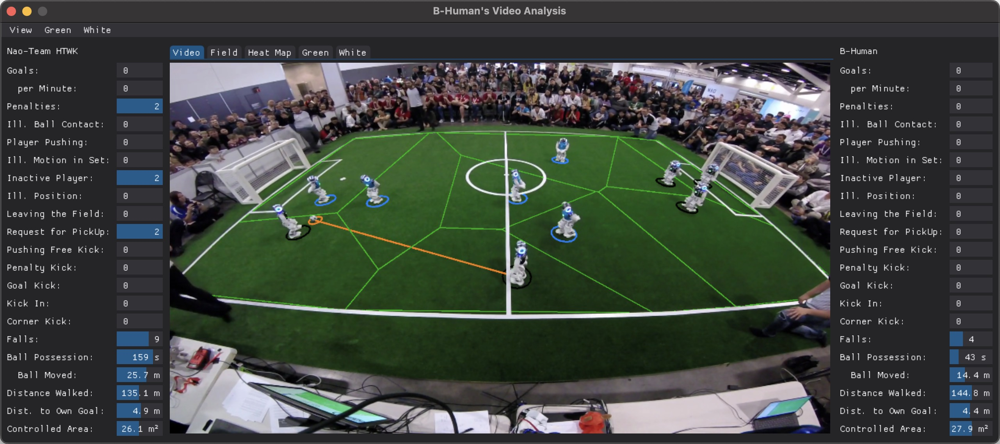
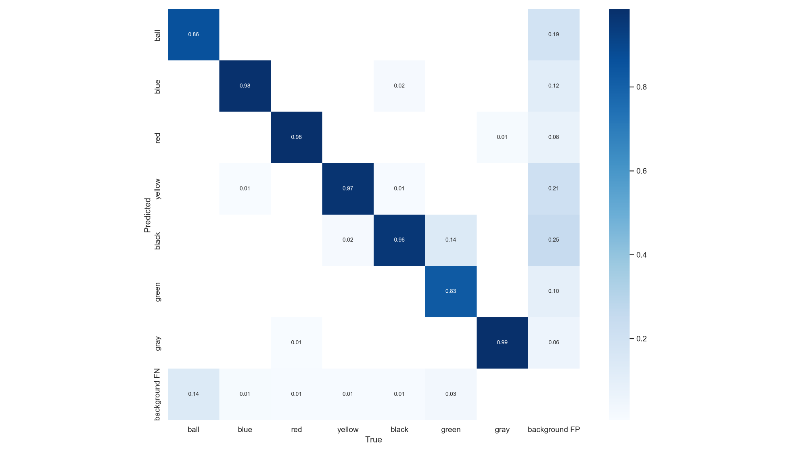
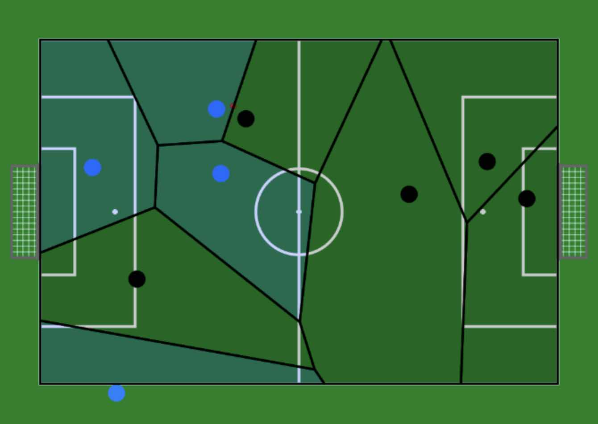
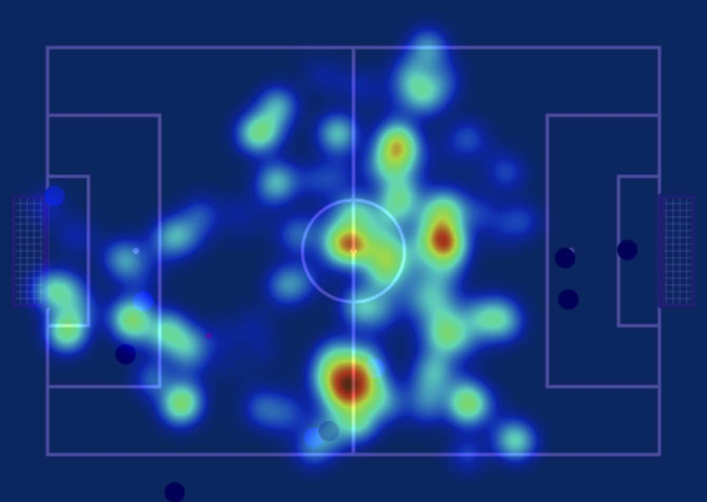

# B-Human's Video Analysis App

In the 2022 RoboCup Standard Platform League Video Analysis Challenge, members from
seven teams labelled images from recordings of RoboCup 2019 soccer games. Each team
labeled the ball and all players including their jersey colors and their jersey
numbers in 5000 images. These 35000 labeled images could then be used by the teams
to develop software that is helpful in automatically analyzing games based on video
recordings. This is B-Human's contribution to this challenge.

*The application showing the video of a half not in the training set with the
positions of the ball and the players. The orange line indicates the ball possession
of the player that just kicked the ball while it is still rolling. The statistics
determined from the GameController log file and from the video are shown next to the
video.*

## Approach

### Object Detection

A YOLOv5 [[1]](#ref) network was trained with an input resolution of 1920x1080 with
bounding boxes of the ball and the players including their jersey colors. Only 682
images were actually used at a 70/20/10 split. The inference takes ~39 ms per image
on an Apple M1 Max processor.

*
Confusion matrix of ball and player colors in the test set
*

### Camera Calibration

To transform the detections from image coordinates into field coordinates, an
intrinsic and an extrinsic camera calibration are needed. We adapted the code
provided by the team Berlin United [[2]](#ref) that offered the ability to optimize
the extrinsic camera calibration using a hard-coded intrinsic calibration. We added
the optimization of the intrinsic calibration together with the extrinsic one. We
also added an inverse transformation from field coordinates back into the image.
The calibration is performed on a background image that is computed from many
images of the video to eliminate moving objects from the field to get a clear view
at the field lines. This image is computed before the first playback of the game
video and stored for later use. The calibration is also performed at this time and
stored as well. More details are given [here](#cc).

### World Model

The bounding boxes of the players are tracked using a centroid multi object tracker
[[3]](#ref) ignoring the colors in YOLOv5’s non-maximum suppression. For each track,
the recent history of colors associated with it is maintained and the most frequent
color is assigned as the player's color. False ball detections are filtered out
based on an assumed maximum speed of the ball. The centers of the bounding boxes are
projected into the world based on an assumed height above ground, i.e. 5 cm for the
ball and 26 cm for the players. If the projection of a player's ground position back
into the image is outside its bounding box, the player is assumed to be fallen.

### Application

The application has five views: One for the game video, a 2D field, a heat map of
the ball's position, and two views for showing the segmentation of green and white,
which is required by the camera calibration approach. The application also reads the
GameController's log file of the game and plays back its events while the the video
is running. Thus, statistics about the game events can be created and other
statistics can, e.g., be limited to the *Playing* state. From the video, statistics
are generated per team about fallen robots, the distance walked, the ball
possession, the distance the ball was moved while in possession of a team, the
average ball distance to the own goal, and the average sizes of the controlled
areas.

|  |  |
|:--:|:--:|
| *2D field view with controlled areas* | *Ball position heat map view* |

## Installing

This repository uses Python 3 (tested with Python 3.10). Since Python wheels
might be compiled from source, the usual C/C++ build tools must be installed. It is
probably best to setup a virtual environment and activate it.[^1] Then run

    pip install -r requirements.txt

[^1]: On macOS, install Miniforge. Run `conda create -n SomeName python=3.10` and
      `conda activate SomeName`. Then, execute `conda install pycairo` before
      running the `pip install` command.

## Usage

To analyze a recorded game, run `bin/analyze.py`. Example:

    bin/analyze.py --log /path/to/gamecontroller-log /paths/to/videos

When a video is opened for the first time, an extrinsic camera calibration is
performed, which delays the start for a while. A half can consist of multiple
videos. In that case, the filenames of the videos must be specified in
chronological order. They will be processed as if they were a single video.

If the app reaches the end of the video playback and is then closed (and not
earlier), a statistics summary is written into the folder `statistics` using a
locale-aware version of the comma-separated values format.

### Options

  - `-l FILE`, `--log FILE`: The path to the GameController log file. Mandatory,
    because a lot of information is used from that log file.

  - `-f FILE`, `--field FILE`: The path to a JSON file that describes the field
    dimensions. The file must have the format that was defined in section 4.8 of the
    2021 SPL rule book, modified by removing the word "Box". If not specified,
    timestamps in the GameController log file are used to guess the field used.

  - `-c FILE`, `--calibration FILE`: The path to a JSON file that contains the
    camera calibration or that it will be written to if it does not exist.

  - `--half NUM`: The half of the game shown in the video (1 or 2). If
    not specified, the half is guessed from the filename of the video.

  - `-n NUM`, `--every-nth-frame NUM`: Only process every nth frame. This speeds up
    playback, but makes the results less reliable. Since the dropped frames still
    have to be extracted from the video file, the playback speed is not directly
    proportional to this value. If not specified, every 10th frame is processed.

  - `--headless`: Run the app without user interface. This option can be used to
    just create the statistics file that is written in the end.

  - `-f`, `--force`: Force a new camera calibration. The first time a video is
    analyzed, a camera calibration is automatically performed and stored. Normally,
    this calibration will be used during further playbacks of the same video. This
    switch overwrites this behavior.

  - `-v`, `--verbose`: Writes additional information to the terminal while
    calibrating and visualizes the results in some PNG files under the path
    `runs/camera/run_*`.

  - `--version`: Show the version of the app and exit.

  - `-h`, `--help`: Show the help message and exit.

### Camera Calibration

The camera calibration runs in three steps:

 1. First, a background image is computed, i.e. ideally an image of an empty field.
    Since a large part of the video is read to compute this image, it takes quite a
    while. However, this is only done once per video and the resulting image is
    stored in the directory `backgrounds`. The parameters used to compute the image
    can be configured in the file `config/settings.json` in the section
    `calibration`:

      - `images`: The number of images to use.

      - `step_size`: Corresponds to the number of images skipped between two that
        are used (plus one), i.e. with a `step_size` of 1 every image is used.

    These two numbers are also part of the filename chosen for the background image.
    If these parameters are changed, another background image will be calculated
    when the app is started the next time.

 2. The field lines are detected in the background image. For this, two colors are
    detected: green and white. Green represents the area of the field. The idea is
    to only accept white pixels that are located on the field, i.e. surrounded by
    green pixels. The approach is to detect both colors using minimum and maximum
    values in the HSV color space and then perform a couple of morphological image
    processing operations to, e.g., close gaps in the detection. The color
    boundaries can be configured interactively by selecting the tabs `Green` or
    `White` and then the corresponding menu as well. In addition, `View/Background`
    can be activated. The values selected are stored in the file
    `config/settings.json` in the sections `green_mask` and `white_mask`. Please
    note that the range of the hue values is 0° ... 180° in the file although the
    color picker uses a range of 0 ... 255. The `green_mask` is also used to create
    the 3D effect when drawing to the video image. Most of the drawings are only
    drawn onto the green areas of the image. This creates the illusion that they
    are hidden behind the (non-green) objects on the field.

 3. The actual optimization of the intrinsic and extrinsic camera parameters is
    performed. It starts from an initial guess, which is taken from the file
    `config/settings.json` in the section `calibration`. The `initial_intrinsics`
    contain the initial values for the intrinsic parameters. All the values except
    for `superview` and `resolution` are adapted during the optimization. The
    `initial_extrinsics` describe the initial guess for the camera's pose. The
    translation is specified in meters. Usually, the first dimension points to the
    right, the second one away from the camera, and the third one upwards. The
    origin is at the center of the field. The rotations are given in degrees. The
    initial guess is rather important, because it is also used to discard outliers
    from the detected field lines. If a point on a field line is further away than
    `outlier_threshold` (in m), it will not be used for the calibration.
    `iterations` defines the maximum number of iterations used during optimization.

All three steps are only performed once. However, the command line parameter
`--force` (or `-f`) can be used to repeat the steps 2 and 3. In addition, the
parameter `--verbose` creates more information about the calibration process. On the
one hand, it creates a directory in `runs/camera` containing two images.
`before.png` contains two graphs showing the detected field line points before and
after the outlier elimination. In particular the latter is important, because if it
does not contain the whole field anymore, the initial guess of the camera parameters
must be adapted. `after.png` shows the corrected field line points. It should look
like a bird's eye view of the field, i.e. with 90° angles in all the corners. This
graph is basically a representation of how well the calibration worked. On the other
hand, the verbose mode prints the calibration error for each iteration (in m) to
the terminal.

## Training the Network

[Here](doc/TRAINING.md) is described, how to train the network from scratch.
However, the actual network provided in `weights/best.pt` was trained a little
differently. The data provided by the team SPQR was not completely ignored. Instead,
a network was first trained as described, but then, a new csv file was created for
SPQR's dataset by using the trained network to detect the objects and associating
them with the classes provided in the original csv file. However, only the first 82%
of the images were actually used, because the robots are rather crowded in the last
images, resulting in some wrong bounding boxes provided by the network. To avoid
training on wrong data, these images were skipped. Afterwards, the network was
trained again, this time with the automatically annotated images from SPQR's
dataset.

## Known Issues

The app provided here is far from being finished. Therefore, there are a number of
known issues, some of which are listed here:

  - The camera calibration depends on reasonable initial guesses for the camera pose
    and the intrinsic camera parameters. With GoPro videos that contain telemetry,
    this is limited to the camera's yaw angle and – to a lesser degree – its
    position.

  - The camera calibration also depends on the detection of the field lines. If the
    lines were painted, it is harder to find appropriate ranges in the color space
    to segment them. If the field corners are missing in the video, the white goals
    can impede the calibration result, because the calibration associates them with
    the field line model and there is not enough goal line visible to counter this.

  - The YOLOv5 network was trained with data from 17 games at RoboCup 2019 and 2023.
    Team colors may appear differently under different lighting conditions.
    Therefore, players might be associated with the wrong team or they are not
    detected at all. Also, the training set was not balanced regarding upright and
    fallen robots. As a result, fallen robots tend to have the wrong team color.

  - The world model is very rudimentary, i.e. not much is known about objects that
    are currently not visible. This in particular affects the computation of the
    ball possession and its visualization.

  - Penalized robots can negatively impact the localization statistics if they are
    still visible in the video in a position where they are not expected.

  - The fall detection is quite simple. It fails if YOLOv5's bounding box does not
    contain the whole robot. This often happens if a robot is partially hidden by
    another robot or a referee.

  - There are many "magic numbers" in the code. Some of them are not even defined as
    named constants.

## References

 1. Glenn Jocher, Ayush Chaurasia, Alex Stoken, Jirka Borovec, NanoCode012, Yonghye
    Kwon, TaoXie, Jiacong Fang, imyhxy, Kalen Michael, Lorna, Abhiram V, Diego
    Montes, Jebastin Nadar, Laughing, tkianai, yxNONG, Piotr Skalski, Zhiqiang Wang,
    Adam Hogan, Cristi Fati, Lorenzo Mammana, AlexWang1900, Deep Patel, Ding Yiwei,
    Felix You, Jan Hajek, Laurentiu Diaconu, Mai Thanh Minh: [ultralytics/yolov5:
    v6.1 – TensorRT, TensorFlow Edge TPU and OpenVINO Export and
    Inference](https://doi.org/10.5281/zenodo.6222936). doi: 10.5281/zenodo.6222936,
    February 2022.

 2. Benjamin Schlotter (2020): [Analyse von RoboCup Spielen Erkennen und
    Lokalisieren von Nao Robotern](https://www.naoteamhumboldt.de/wp-content/papercite-data/pdf/2020_studienarbeit_schlotter.pdf).
    Studienarbeit. Humboldt-Universität zu Berlin.

 3. Aditya M. Deshpande (2021). [Multi-object trackers in Python](https://adipandas.github.io/multi-object-tracker/).

 ---
