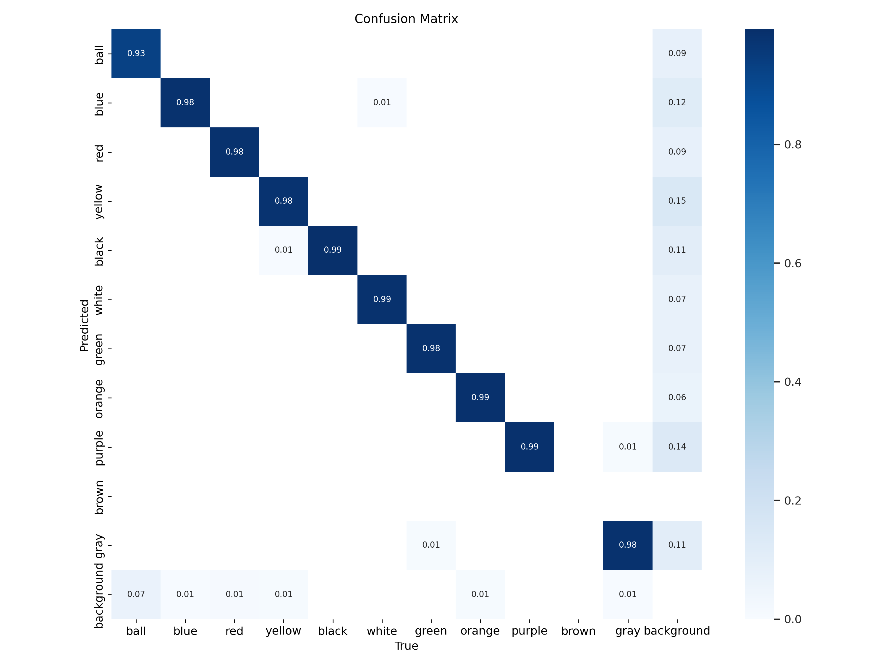

# B-Human's Video Analysis App

In the 2022 RoboCup Standard Platform League Video Analysis Challenge, members from
seven teams labelled images from recordings of RoboCup 2019 soccer games. Each team
labeled the ball and all players including their jersey colors and their jersey
numbers in 5000 images. These 35000 labeled images could then be used by the teams
to develop software that is helpful in automatically analyzing games based on video
recordings. This is B-Human's contribution to this challenge.

*The application showing the video of a half not in the training set with the
positions of the ball and the players. The orange line indicates the ball possession
of the player that just kicked the ball while it is still rolling. The statistics
determined from the GameController log file and from the video are shown next to the
video.*

## Approach

### Object Detection

A YOLOv5 [[1]](#ref) network was trained with an input resolution of 1920x1080 with
bounding boxes of the ball and the players including their jersey colors. Only 682
images were actually used at a 70/20/10 split. The inference takes ~55 ms per image
on an M1 Apple Neural Engine.

*
Confusion matrix of ball and player colors in the test set
*

### Extrinsic Camera Calibration

To transform the detections from image coordinates into field coordinates, an
intrinsic and an extrinsic camera calibration are needed. We adapted the code
provided by the team Berlin United [[2]](#ref) and added an inverse transformation
from field coordinates back into the image. The calibration is performed before the
first playback of a game video and then stored for later uses.

### World Model

The bounding boxes of the players are tracked using a centroid multi object tracker
[[3]](#ref) ignoring the colors in YOLOv5’s non-maximum suppression. For each track,
the recent history of colors associated with it is maintained and the most frequent
color is assigned as the player's color. False ball detections are filtered out
based on an assumed maximum speed of the ball. The centers of the bounding boxes are
projected into the world based on an assumed height above ground, i.e. 5 cm for the
ball and 26 cm for the players. If the projection of a player's ground position back
into the image is outside its bounding box, the player is assumed to be fallen.

### Application

The application has five views: One for the game video, a 2D field, a heat map of
the ball's position, and two views for showing the segmentation of green and white,
which is required by the camera calibration approach. The application also reads the
GameController's log file of the game and plays back its events while the the video
is running. Thus, statistics about the game events can be created and other
statistics can, e.g., be limited to the *Playing* state. From the video, statistics
are generated per team about fallen robots, the distance walked, the ball
possession, the distance the ball was moved while in possession of a team, the
average ball distance to the own goal, and the average sizes of the controlled
areas.

|  |  |
|:--:|:--:|
| *2D field view with controlled areas* | *Ball position heat map view* |

## Installing

This repository uses Python 3 (tested with Python 3.8 and 3.9). Since Python wheels
might be compiled from source, the usual C/C++ build tools must be installed. It is
probably best to setup a virtual environment and activate it.[^1] Then run

    pip install -r requirements.txt

[^1]: On macOS, install Miniforge. Run `conda create -n SomeName python=3.9` and
`conda activate SomeName`. Then, execute `conda install pycairo` before running the
`pip install` command.

## Usage

To analyze a recorded game, run `bin/analyze.py`. Example:

    bin/analyze.py --log /path/to/gamecontroller-log /path/to/video

When a video is opened for the first time, an extrinsic camera calibration is
performed, which delays the start for a while.

If the app reaches the end of the video playback and is then closed (and not
earlier), a statistics summary is written into the folder `statistics` using a
locale-aware version of the comma-separated values format.

### Options

  - `-l FILE`, `--log FILE`: The path to the GameController log file. Mandatory,
    because a lot of information is used from that log file.

  - `-f FILE`, `--field FILE`: The path to a JSON file that describes the field
    dimensions. The file must have the format that was defined in section 4.8 of the
    2021 SPL rule book, modified by removing the word "Box". If not specified,
    timestamps in the GameController log file are used to guess the field used.

  - `-c FILE`, `--calibration FILE`: The path to a JSON file that contains the
    camera calibration or that it will be written to if it does not exist.

  - `--half NUM`: The half of the game shown in the video (1 or 2). If
    not specified, the half is guessed from the filename of the video.

  - `-n NUM`, `--every-nth-frame NUM`: Only process every nth frame. This speeds up
    playback, but makes the results less reliable. Since the dropped frames still
    have to be extracted from the video file, the playback speed is not directly
    proportional to this value. If not specified, every 10th frame is processed.

  - `--headless`: Run the app without user interface. This option can be used to
    just create the statistics file that is written in the end.

  - `-f`, `--force`: Force a new camera calibration. The first time a video is
    analyzed, a camera calibration is automatically performed and stored. Normally,
    this calibration will be used during further playbacks of the same video. This
    switch overwrites this behavior.

  - `-s`, `--skip`: Skips the camera calibration even if none exists. This can be
    useful for starting the app quickly to first manually calibrate the green and
    white before attempting a camera calibration.

  - `-v`, `--verbose`: Writes additional information to the terminal while
    calibrating and visualizes the results in some PNG files under the path
    `runs/camera/run_*`.

  - `--version`: Show the version of the app and exit.

  - `-h`, `--help`: Show the help message and exit.

## Training the Network

[Here](doc/TRAINING.md) is described, how to train the network from scratch.
However, the actual network provided in `weights/best.pt` was trained a little
differently. The data provided by the team SPQR was not completely ignored. Instead,
a network was first trained as described, but then, a new csv file was created for
SPQR's dataset by using the trained network to detect the objects and associating
them with the classes provided in the original csv file. However, only the first 82%
of the images were actually used, because the robots are rather crowded in the last
images, resulting in some wrong bounding boxes provided by the network. To avoid
training on wrong data, these images were skipped. Afterwards, the network was
trained again, this time with the automatically annotated images from SPQR's
dataset.

## Known Issues

The app provided here is far from being finished. Therefore, there are a number of
known issues, so of which are listed here:

  - The camera calibration only performs an extrinsic calibration, i.e. the
    intrinsic calibration of the camera must already be known. The app currently
    only supports a GoPro HERO 5 camera in wide mode. In addition, the calibration
    also depends on a reasonable initial guess for the camera pose.

  - The game recording solution developed by Berlin United only records games when
    the game state is not `Initial`. As a result, timeout are not recorded in the
    videos. The app cannot handle situations, in which a timeout was taken after the
    first `Ready` state, because such a half would be recorded as two videos and it
    is assumed that videos always start with the first switch to `Ready`.

  - The YOLOv5 network was trained with data from a few games at RoboCup 2019. Team
    colors may appear differently under different lighting conditions. Therefore,
    players might be associated with the wrong team or they are not detected at all.
    In addition, the training set did not include the colors white and orange.
    Therefore, the network cannot detect them. Also, the training set was not
    balanced regarding upright and fallen robots. As a result, fallen robots tend to
    have the wrong team color.

  - The world model is very rudimentary, i.e. not much is known about objects that
    are currently not visible. This in particular affects the computation of the
    ball possession and its visualization.

  - The fall detection is quite simple. It fails if YOLOv5's bounding box does not
    contain the whole robot. This often happens if a robot is partially hidden by
    another robot or a referee.

  - There are many "magic numbers" in the code. Some of them are not even defined as
    named constants.

## References

 1. Glenn Jocher et al.: [ultralytics/yolov5: v3.1 – Bug Fixes and Performance
    Improvements](https://doi.org/10.5281/zenodo.4154370). Zenodo.

 2. Benjamin Schlotter (2020): [Analyse von RoboCup Spielen Erkennen und
    Lokalisieren von Nao Robotern](https://www.naoteamhumboldt.de/wp-content/papercite-data/pdf/2020_studienarbeit_schlotter.pdf).
    Studienarbeit. Humboldt-Universität zu Berlin.

 3. Aditya M. Deshpande (2021). [Multi-object trackers in Python](https://adipandas.github.io/multi-object-tracker/).
